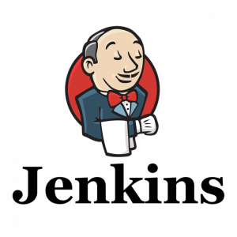
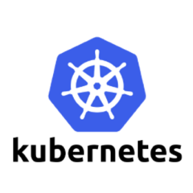
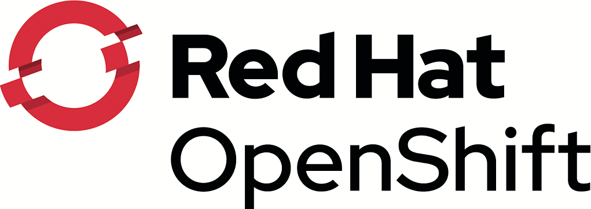
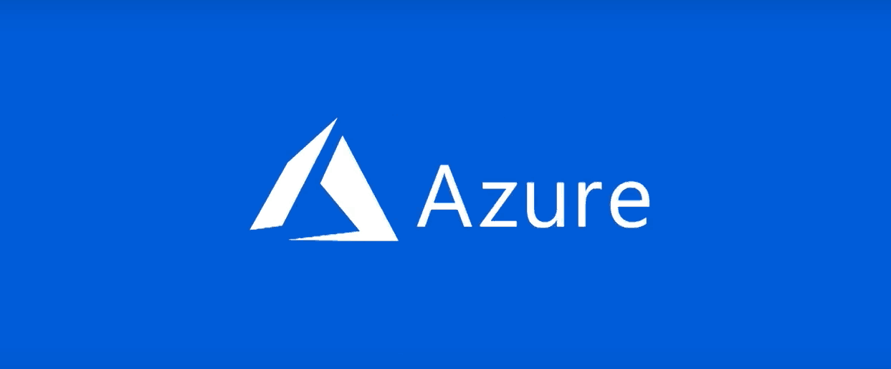

# Hi, I'm Brad :wave:

I'm a Cloud DevOps Engineer/Infrastructure Engineer, who is passionate about learning development and creating technology or infrastructure that not only evelates companies but people. Some technologies I enjoy working with include VMWare, HyperV, RedHat, Kubernetes and cloud platforms(AWS and Azure). 

I have started intro to programming courses to gain knowledge that would allow me to better assist businesses.

