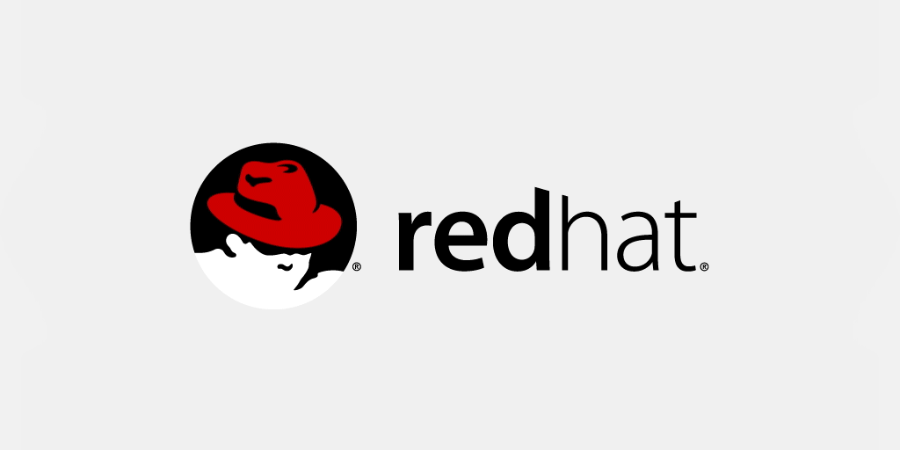

# Hi, I'm Brad :wave:

I'm a Cloud DevOps Engineer/Infrastructure Engineer, who is passionate about learning development and creating technology or infrastructure that not only evelates companies but people. Some technologies I enjoy working with include VMWare, HyperV, RedHat, Kubernetes and cloud platforms (AWS and Azure). 

I have started intro to programming courses to gain knowledge that would allow me to better assist businesses.

- Virtualization technologies - VMWare, Hyper V
- Operating Systems - Windows, Linux
- Cloud Platforms -AWS, Azure
- Certificates - VMWare VCP, MCSE, MCSA, Nanodegree Cloud Devops, MS Specialist HyperV and Systems Center, Exchange, Linux Essentials, DevOps Essentials

